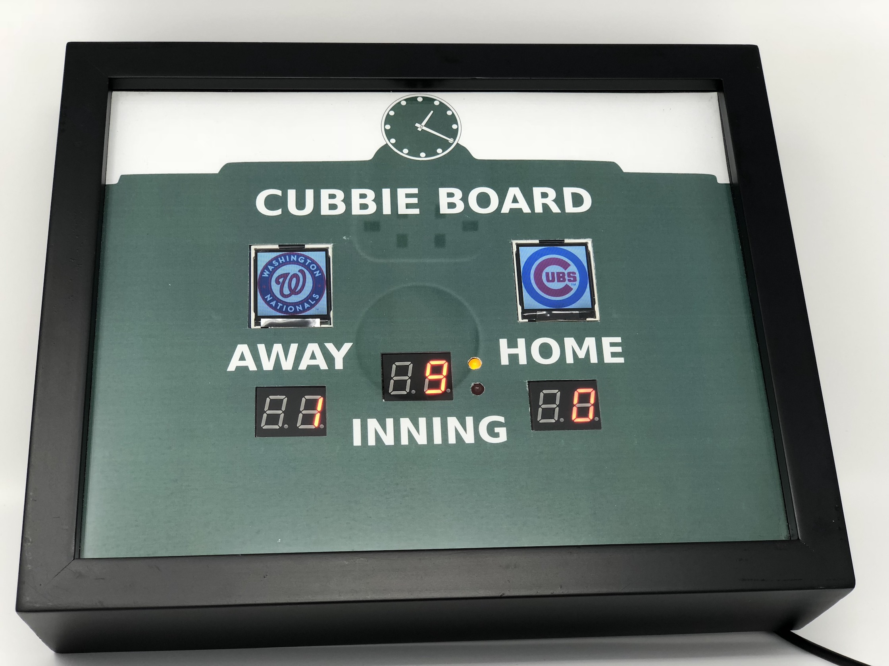
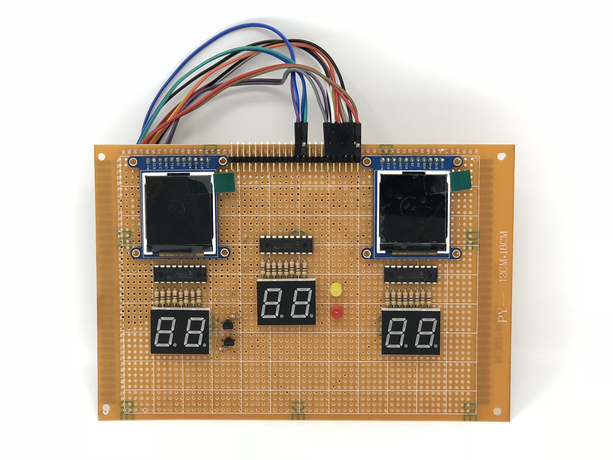
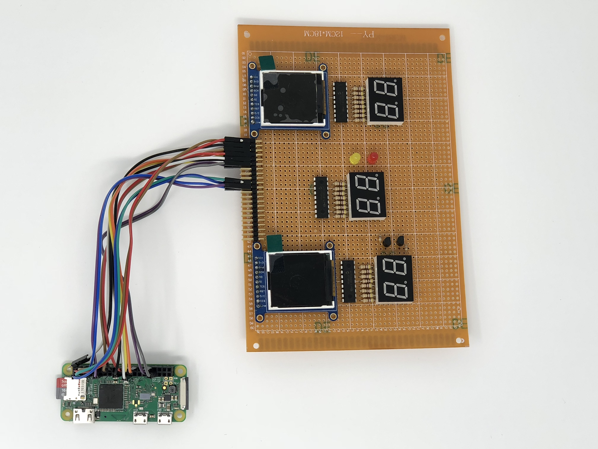
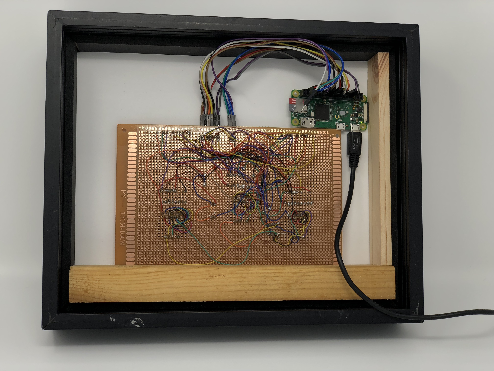

# Cubbie Board

The Cubbie Board is an IOT, Chicago Cubs-themed baseball scoreboard. Powered by Python and a Raspberry Pi Zero W,
this scoreboard will display your preferred team's game when live and cycle through other games when not.

## Parts List

* 1 [Raspberry Pi Zero W](http://a.co/6ZoiTxW), the brain of the system
* 2 [Adafruit LCD TFT Displays](https://www.adafruit.com/product/2088) for team logos
* 3, 2-digit, 7-segment displays for inning and team runs displays (Can be found on eBay)
* 3 [MCP23008 IO expanders](https://www.adafruit.com/product/593) for extra IO to control the 7-segment displays
* 10, 12 x 18 cm Prototyping PCB board for attaching the components
* Red and Yellow (or whatever color) LEDs for the inning-state
* 2 P2N2222A NPN Transistors for controlling which digit on each display is enabled
* 24 470 Ohm Resistors for the 7-segment displays
* Right angle double row headers for connecting components to the Raspberry Pi
* Male to female wire jumpers for connecting to Raspberry Pi
* Female 2 x 20 header for Raspberry Pi
* 8" x 10" Shadow Box for mounting the scoreboard
* Soldering equipment
* Scrap Wood to help mount the Pi and PCB in the shadow box
* Some resistors for the transistors

## Hardware Configuration

### LCD Displays
The LCD displays are controlled through an SPI interface. The Power, Clock, Slave In, and Data Command pins are
shared between both displays. Each display has its own separate Slave Select, Reset, and Lite (PWM backlight) pins.

### 7-Segment Displays
Each dual 7-segment display has shared anode pins for each segment and 2 separate, common-cathode pins for each digit.
Each segment of each display (minus the 'DP') is connected to one of the MCP23008 IO pins via a current-limiting 470
ohm resistor. The 8th pin on the home and away IO expander chips is used to power the top and bottom inning LEDs, 
also with resistors.

The digit being displayed on each dual 7-segment display is dependent on which common-cathode is pulled low. If both 
are pulled low, the same digit will be displayed on both digits of the display. To control which digit is being
displayed, there are 2 NPN transistors. The right digits' common-cathodes are connected to the same transistor, as are 
the left digits' CC. So for basic single digit use, only the right digit transistor is pulled low.

## Software Configuration
### MLB Data
MLB game information is obtained through an AWS Lambda abstraction API. The lambda functions receive requests from 
the Raspberry Pi, obtain the data needed and return it in a lighter, JSON format that's easier for the Pi to process. 
The Lambda function obtains game information using the mlbgame API, developed by Panzarino.

### 7-Segment Displays
The 7-segment displays are controlled by a class for each physical display, and all of those are controlled by a 
manager class. The manager class is threaded and coordinates how updates are done and whether the displays show 1 or 
2 digits at a time. If 2 digits must be displayed on a display, the manager must rapidly blink the digits back and 
forth to light them both up.

### LCD Displays
The LCD displays are also controlled by individual LCD class instances and a single LCD manager class. The LCD class 
inherits from a forked Adafruit library (link below) which does the work of displaying images on the displays.

#### Backlight PWM
The display's brightness is controlled via a threaded backlight controller class, using PWM. This class controls how 
gradual brightness changes are executed and is an attribute of each display instance.

## Dependencies

* Python 2.7 (not compatible with 3)
* [mlbgame](http://panz.io/mlbgame/)
* [Pillow](https://python-pillow.org)
* Adafruit_GPIO (available on PyPI)
* RPi.GPIO (also available on PyPI)
* [This fork](https://github.com/KYDronePilot/Adafruit_ST7735r) of the Python ST7735r library
* [PiGPIO](http://abyz.me.uk/rpi/pigpio/)
* python-decouple
* typing
* requests

## Questions

If you have any questions about the project or would like additional information, please create an issue. I'll do my 
best to answer your questions as best as possible.
